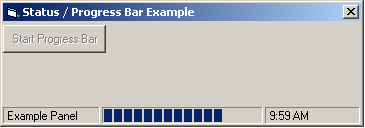



## Progress bar running in Status bar

### Description

this application shows u how u can put a progress bar in u r status bar. u can use this code in any type of u r applcations. its soo cool.
 
### More Info
 

             |
---                |---
**Submitted On**   |2004-12-01 00:39:02
**By**             |[Anuj sharrma](https://github.com/Planet-Source-Code/PSCIndex/blob/master/ByAuthor/anuj-sharrma.md)
**Level**          |Beginner
**User Rating**    |4.5 (76 globes from 17 users)
**Compatibility**  |VB 6\.0
**Category**       |[Coding Standards](https://github.com/Planet-Source-Code/PSCIndex/blob/master/ByCategory/coding-standards__1-43.md)
**World**          |[Visual Basic](https://github.com/Planet-Source-Code/PSCIndex/blob/master/ByWorld/visual-basic.md)
**Archive File**   |[Progress\_b1823531212004\.zip](https://github.com/Planet-Source-Code/anuj-sharrma-progress-bar-running-in-status-bar__1-57480/archive/master.zip)

